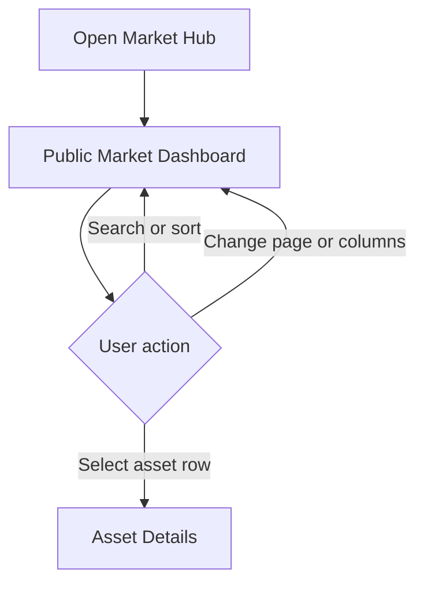
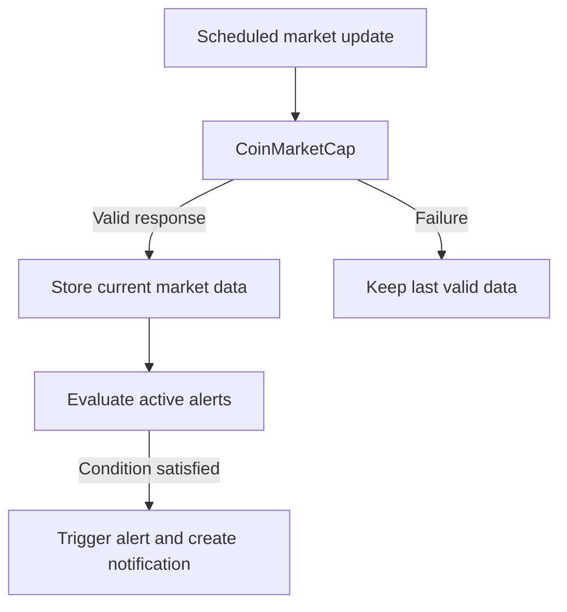

# Market Hub — Product Requirements Document

**Version:** 0.1  
**Last Updated:** 2026-07-31  
**Status:** Draft  
**Phase 1 Delivery:** Web application  

---

## 1. Background

### 1.1 Problem Statement

People who follow cryptocurrency markets often need to move between several tools to view current prices, compare important market metrics, inspect individual assets, and create price alerts. Many existing products also combine market monitoring with trading, wallets, social features, and advanced analytics, which can make the basic monitoring experience unnecessarily complex.

Market Hub addresses this problem by providing a focused cryptocurrency-monitoring experience. Phase 1 delivers a shared public market dashboard, basic asset search, asset details, secure user accounts, and one-time in-application price alerts.

The first release intentionally favors a simple implementation and a narrow scope. It does not execute trades, connect to wallets or exchanges, manage investment portfolios, or attempt to provide financial advice.

### 1.2 Product Overview

Market Hub is a market-monitoring platform for viewing financial assets through dashboard-based interfaces.

Phase 1 is delivered as a web application. Market Hub periodically retrieves a configured top-N cryptocurrency universe from CoinMarketCap and stores the latest successful market data for use throughout the product. User-facing requests use Market Hub's stored data rather than calling CoinMarketCap directly.

The Public Market Dashboard is the default landing page and is available to guests and registered users. It presents the same system-defined cryptocurrency set to all users. Registered users can persist supported view preferences, such as visible columns, but cannot change the Phase 1 asset set.

Registered users can create one-time price alerts. Alert conditions are evaluated after each successful market-data polling cycle. When a condition is satisfied, the alert becomes inactive and an in-application notification is created.

Phase 1 supports:

- Cryptocurrency assets only
- USD monetary values only
- Email-and-password authentication
- Web access only

Personal dashboards, portfolio management, Android, stocks, and administrative asset configuration are planned for Phase 2 or later.

### 1.3 Target Users

| User Type | Description | Primary Phase 1 Goals |
| --- | --- | --- |
| **Guest** | Anonymous visitor without an account. | Browse the public market dashboard, search the available cryptocurrency set, and view asset details. |
| **Registered User / Trader** | Authenticated individual who monitors cryptocurrency markets. The system role is `TRADER`. | Use the public dashboard, save supported display preferences, manage price alerts, view notifications, and manage their account. |
| **Retail Investor** | Product persona representing a medium- or long-term market participant. Uses the `TRADER` system role. | Monitor market assets and receive price alerts. Portfolio management is deferred to Phase 2. |
| **Active Trader** | Product persona representing a user who follows shorter-term market movements. Uses the `TRADER` system role. | Review market information quickly and configure multiple price alerts. |
| **Administrator** | Authorized platform operator with the `ADMIN` role. | View users, block or unblock accounts, and review relevant audit records. |
| **Moderator** | Reserved system role (`MODERATOR`) for possible future use. | No Phase 1 permissions or workflows. |

### 1.4 Product Principles

- **Simple first release:** Prefer a basic, maintainable implementation over speculative infrastructure or advanced configuration.
- **Read-focused product:** Market Hub monitors markets; it does not trade, hold funds, or connect to wallets in Phase 1.
- **Provider independence:** Product behavior should not depend unnecessarily on provider-specific behavior.
- **Shared market universe:** Phase 1 uses one application-defined cryptocurrency set for all users.
- **Stored market data:** User requests read stored data; they do not directly trigger an upstream market-data request.
- **Progressive expansion:** Additional clients, asset classes, personalization, and administration are added in later phases.

### 1.5 System Context

| Entity or Component | Phase 1 Purpose |
| --- | --- |
| **Guest and Registered Users** | Access Market Hub through the web application. |
| **Market Hub Web Application** | Provides the Phase 1 user experience and access to product capabilities. |
| **Market Hub Services** | Provide authentication, authorization, market data, alerts, notifications, account management, and administration. |
| **CoinMarketCap** | Supplies the configured top-N cryptocurrency market data. |
| **Transactional Email Capability** | Delivers password-reset communication. It is not a Phase 1 market-alert notification channel. |
| **Android Application** | Planned Phase 2 client; not part of the Phase 1 delivery. |

---

## 2. Features & Scope

### 2.1 Feature Overview

| ID | Feature | Description | Priority | Delivery |
| --- | --- | --- | --- | --- |
| **F-001** | Public Market Dashboard | Display a system-managed, paginated grid containing the configured top cryptocurrencies and supported market metrics. | Must Have | Phase 1 |
| **F-002** | Grid Search | Search the Public Market Dashboard dataset by cryptocurrency name or symbol. | Must Have | Phase 1 |
| **F-003** | Asset Details | Display detailed provider-supplied information for a selected cryptocurrency. | Must Have | Phase 1 |
| **F-004** | User Authentication | Register, sign in, sign out, reset a password, and protect authenticated features using email and password. | Must Have | Phase 1 |
| **F-005** | Personal Dashboards | Create multiple named dashboards and explicitly add selected supported assets. | Must Have | Phase 2 |
| **F-006** | Price Alerts | Create and manage one-time above/below cryptocurrency price alerts. | Must Have | Phase 1 |
| **F-007** | Notifications | Create, display, and clear in-application notifications for triggered alerts. | Must Have | Phase 1 |
| **F-008** | Portfolio Management | Maintain personal cryptocurrency holdings. | Should Have | Phase 2 |
| **F-009** | Account Management | View and update the current user's account information and change the password. | Should Have | Phase 1 |
| **F-010** | Administrator User Management | View users and block or unblock accounts. | Should Have | Phase 1 |
| **F-011** | Android Application | Provide the core Market Hub experience through an Android client. | Must Have | Phase 2 |
| **F-012** | Stock Market Support | Add publicly traded stocks and stock-specific information. | Must Have | Phase 2 |
| **F-013** | Financial News Wall | Display relevant market news from external providers. | Should Have | Future; phase to be confirmed |
| **F-014** | AI Market Assistant | Provide an independently integrated assistant for natural-language market questions and summaries. | Could Have | Future |
| **F-015** | Social Authentication | Authenticate through external identity providers using OAuth 2.0/OpenID Connect. | Should Have | Phase 2 |
| **F-016** | Asset Administration | Approve or remove assets that may be used by public and personal dashboards. | Must Have | Phase 2 |
| **F-017** | Public Dashboard Configuration | Configure the public asset set, columns, page sizes, and refresh interval at runtime. | Should Have | Phase 2 |

### 2.2 Phase 1 Scope

#### Included

- Web application
- Periodic retrieval of the configured CoinMarketCap cryptocurrency universe
- Storage and reuse of the latest successfully retrieved market data
- Public Market Dashboard
- Grid search by cryptocurrency name or symbol
- Asset Details
- Email-and-password registration and authentication
- Authenticated access to personal features
- Password reset
- User account management
- Registered-user visible-column preferences
- One-time above/below price alerts
- In-application alert notifications
- Administrator user listing and account blocking/unblocking
- Administrative audit records
- Cryptocurrency assets only
- USD display only

#### Explicitly Out of Scope for Phase 1

- Personal dashboards
- Portfolio management
- Android and iOS applications
- Stock-market support
- Runtime asset approval and removal
- Runtime Public Market Dashboard configuration
- Social authentication
- Market-alert delivery by email, push notification, or SMS
- Financial news
- AI Market Assistant
- Trading or brokerage integration
- Cryptocurrency wallet integration
- Exchange or wallet synchronization
- Social features, including sharing, comments, and communities
- Advanced portfolio analytics or investment insights
- Multi-language user interface
- Historical-data analytics unless explicitly added to the Asset Details field definition

### 2.3 Phase 2 Scope

Phase 2 is planned to include:

- Personal dashboards that start empty and contain assets explicitly selected by their owner
- Multiple dashboards per user
- Per-dashboard column and sorting preferences
- Cryptocurrency portfolio management
- Android application
- Stock-market support
- Social authentication using OAuth 2.0/OpenID Connect
- Administrator-managed approved-asset list
- Runtime Public Market Dashboard configuration

Phase 2 features remain subject to separate detailed design and release planning.

### 2.4 Future Scope

- Financial news aggregation
- AI Market Assistant
- Push, email, and SMS delivery of market alerts
- iOS application
- Additional currencies
- Additional asset classes
- Multi-language UI
- Advanced portfolio analytics
- Trading, brokerage, exchange, or wallet integrations
- Social and community features

---

### 2.5 F-001 — Public Market Dashboard

#### Goal

Provide all users with a simple overview of the cryptocurrency market through a system-managed dashboard displaying the top cryptocurrencies and their principal market metrics.

#### Actors

- Guest
- Registered User
- Administrator, for Phase 2 configuration only

#### Description

The Public Market Dashboard is the default landing page.

It displays an application-defined set of top cryptocurrencies in a paginated grid. Each row represents one cryptocurrency. The columns contain market information supported by the configured CoinMarketCap integration.

The Phase 1 asset set and default dashboard configuration are defined by the application and shared by all users. Registered users can persist which supported columns are visible in their own view. Guest users always receive the default configuration and do not have persistent dashboard preferences.

Selecting any cryptocurrency row opens the corresponding Asset Details page.

#### Functional Requirements

| ID | Requirement |
| --- | --- |
| **F001-FR-001** | The system shall display a predefined set of top cryptocurrencies. |
| **F001-FR-002** | The default order shall follow the market-capitalization ranking supplied by CoinMarketCap. |
| **F001-FR-003** | The dashboard shall present cryptocurrency market information in a tabular grid. |
| **F001-FR-004** | Each row shall represent one cryptocurrency. |
| **F001-FR-005** | Available dashboard fields shall be based on data supplied by the configured CoinMarketCap integration. |
| **F001-FR-006** | The application shall define a default set of visible columns. |
| **F001-FR-007** | Registered users shall be able to show or hide supported columns. |
| **F001-FR-008** | Guest users shall use the default dashboard configuration and shall not have persistent dashboard preferences. |
| **F001-FR-009** | Selecting a cryptocurrency row shall open its Asset Details page. |
| **F001-FR-010** | The dashboard shall support sorting by supported columns. |
| **F001-FR-011** | Sorting shall be applied to the complete matching dataset before pagination. |
| **F001-FR-012** | The dashboard shall provide basic search within the dashboard cryptocurrency dataset. |
| **F001-FR-013** | The dashboard shall use pagination. |
| **F001-FR-014** | The default page size shall be 20 rows in the Phase 1 web application. |
| **F001-FR-015** | Users shall be able to select another page size from a predefined list of supported values. |
| **F001-FR-016** | The dashboard shall refresh displayed market data automatically. |
| **F001-FR-017** | Users shall be able to request a manual refresh of the displayed data. |
| **F001-FR-018** | A refresh shall preserve the current page, page size, sorting, search, and visible-column configuration. |
| **F001-FR-019** | The system shall display the time of the last successful market-data update. |
| **F001-FR-020** | If refresh fails after data has loaded, the dashboard shall continue displaying the last successfully loaded data. |
| **F001-FR-021** | The dashboard shall be accessible to guests and registered users. |
| **F001-FR-022** | Phase 1 monetary values shall be displayed in USD. |
| **F001-FR-023** | Guest users shall not be able to save favorite cryptocurrencies. |

#### Business Rules

- The Phase 1 dashboard asset set is system-managed and read-only for all users.
- All users see the same system-defined cryptocurrency universe.
- The exact default columns are selected from fields available through CoinMarketCap.
- Column reordering is not required in Phase 1.
- Search uses the minimal behavior defined by F-002.
- The configured polling frequency must comply with the active CoinMarketCap plan, update frequency, and API rate limits.
- User-facing refresh reloads data from Market Hub. It does not require an immediate CoinMarketCap API call.
- A manual refresh does not guarantee that CoinMarketCap has published newer data.

#### Phase 1 Failure Behavior

- Previously loaded data remains visible when refreshed data cannot be obtained.
- The last successful update time remains visible.
- The UI displays a basic refresh failure indication.
- Advanced stale-data classification and recovery workflows are out of scope.

#### Acceptance Criteria

- A guest can open the dashboard without authentication.
- The configured top cryptocurrencies are displayed.
- Twenty rows are displayed by default.
- A user can navigate between pages and select a supported page size.
- A user can sort the complete matching dataset by a supported column.
- A user can search the dashboard dataset.
- Selecting any part of an asset row opens the corresponding Asset Details page.
- Registered users can show and hide supported columns.
- Guest users receive the default dashboard configuration.
- Displayed data refreshes automatically.
- A user can request a manual display refresh.
- The dashboard state is preserved during refresh.
- Previously loaded data remains visible when refresh fails.
- The last successful update time is displayed.

---

### 2.6 F-002 — Grid Search

#### Goal

Allow users to find a cryptocurrency quickly within the Public Market Dashboard.

#### Actors

- Guest
- Registered User

#### Description

The Public Market Dashboard includes a basic search field. A user can search by cryptocurrency name or symbol. Search operates only on the dashboard dataset stored by Market Hub; it is not a separate global asset-catalog search.

#### Functional Requirements

| ID | Requirement |
| --- | --- |
| **F002-FR-001** | Users shall be able to search by cryptocurrency name. |
| **F002-FR-002** | Users shall be able to search by cryptocurrency symbol. |
| **F002-FR-003** | Matching shall be case-insensitive. |
| **F002-FR-004** | The grid shall display matching rows. |
| **F002-FR-005** | If no match exists, the grid shall display a simple “No results found” state. |
| **F002-FR-006** | Clearing the search field shall restore the full dashboard dataset. |

#### Business Rules

- Search applies only to the Public Market Dashboard cryptocurrency dataset.
- Search does not call CoinMarketCap or query a separate global asset catalog.
- Sorting is applied to the complete matching result before pagination.
- Search is intentionally basic in Phase 1; fuzzy matching and advanced query syntax are out of scope.

#### Acceptance Criteria

- Entering a cryptocurrency name displays its matching row or rows.
- Entering a symbol displays its matching row or rows.
- Search is case-insensitive.
- Clearing the search restores the complete dashboard dataset.
- A simple empty state appears when no match exists.

---

### 2.7 F-003 — Asset Details

#### Goal

Provide users with detailed information about a selected cryptocurrency.

#### Actors

- Guest
- Registered User

#### Description

The Asset Details page displays the available configured market information for one cryptocurrency. In Phase 1, users reach it by selecting a row in the Public Market Dashboard.

The page reads the latest successfully stored data supplied by the configured market-data provider.

#### Functional Requirements

| ID | Requirement |
| --- | --- |
| **F003-FR-001** | The system shall display detailed information for the selected cryptocurrency. |
| **F003-FR-002** | Displayed information shall originate from the configured market-data provider and be read from Market Hub's stored market data. |
| **F003-FR-003** | The page shall present available cryptocurrency information in a clear and readable format. |
| **F003-FR-004** | The page shall be accessible to guests and registered users. |
| **F003-FR-005** | The page shall refresh displayed information automatically. |
| **F003-FR-006** | The page shall display the time of the last successful market-data update. |
| **F003-FR-007** | An unknown or unavailable asset identifier shall produce a clear not-found state. |

#### Business Rules

- The page is read-only.
- Phase 1 displays USD monetary values.
- Only assets from the Phase 1 system-defined universe are accessible.
- The page refresh frequency follows the web application's refresh behavior and does not force an upstream request.

#### Failure Behavior

- The latest successfully stored data remains visible when new market data cannot be retrieved.
- A basic indication may tell the user that current data could not be refreshed.

#### Acceptance Criteria

- Selecting a cryptocurrency row opens the correct Asset Details page.
- Available asset information is displayed successfully.
- The page is accessible without authentication.
- Displayed information refreshes automatically.
- The last successful market-data update time is visible.
- An invalid asset identifier produces a not-found response and UI state.

---

### 2.8 F-004 — User Authentication

#### Goal

Allow users to access personal Market Hub features securely.

#### Actors

- Guest
- Registered User

#### Description

Users can register with an email address and password, sign in, sign out, and reset their password. Successful sign-in creates an authenticated session used to access protected features.

Phase 1 authentication is managed by Market Hub. Social identity providers are deferred to Phase 2.

#### Functional Requirements

| ID | Requirement |
| --- | --- |
| **F004-FR-001** | The system shall allow a user to register using an email address and password. |
| **F004-FR-002** | The system shall allow a registered, unblocked user to sign in. |
| **F004-FR-003** | The system shall allow an authenticated user to sign out. |
| **F004-FR-004** | The system shall allow a user to reset a forgotten password through a time-limited reset process. |
| **F004-FR-005** | The system shall restrict personal and administrative features to authenticated users with the required role. |
| **F004-FR-006** | The system shall track consecutive failed sign-in attempts. |
| **F004-FR-007** | The system shall temporarily reject sign-in after the configured maximum number of consecutive failed attempts. |
| **F004-FR-008** | The system shall reset the consecutive-failure counter after a successful sign-in. |
| **F004-FR-009** | The system shall reject authenticated access for an administratively blocked account. |
| **F004-FR-010** | Passwords shall never be stored in plaintext. |

#### Business Rules

- Phase 1 supports email-and-password authentication.
- Each normalized email address is associated with only one account.
- Maximum consecutive failures and temporary-block duration are configurable.
- Administrative account blocking is independent of temporary failed-attempt blocking.
- `TRADER` is the standard registered-user role.
- `ADMIN` grants administrative permissions.
- `MODERATOR` is reserved and grants no Phase 1 workflow.
- Password-reset communication is transactional authentication communication, not a market-alert channel.

#### Acceptance Criteria

- A new user can register with a unique valid email address and valid password.
- A registered, unblocked user can sign in.
- An authenticated user can sign out.
- A user can complete the password-reset process.
- Guests cannot access protected features.
- Sign-in is temporarily rejected after the configured number of consecutive failed attempts.
- Successful sign-in resets the consecutive-failure counter.
- An administratively blocked user cannot access authenticated features.

---

### 2.9 F-006 — Price Alerts

#### Goal

Allow registered users to create and manage one-time cryptocurrency price alerts.

#### Actors

- Registered User

#### Description

A user creates an alert for a supported cryptocurrency, target USD price, and condition: price at or above the target, or price at or below the target.

After every successful market-data retrieval cycle, the system evaluates active alerts against the newly stored prices. When a condition is satisfied, the system triggers the alert once, marks it inactive, and creates one in-application notification.

#### Functional Requirements

| ID | Requirement |
| --- | --- |
| **F006-FR-001** | The system shall allow an authenticated user to create a price alert. |
| **F006-FR-002** | An alert shall identify a supported cryptocurrency, a positive target USD price, and an `ABOVE_OR_EQUAL` or `BELOW_OR_EQUAL` condition. |
| **F006-FR-003** | The system shall allow a user to list their active alerts. |
| **F006-FR-004** | The system shall allow a user to update or delete an active alert. |
| **F006-FR-005** | The system shall evaluate active alerts after each successful market-data poll. |
| **F006-FR-006** | A satisfied alert shall be marked triggered and shall no longer be active. |
| **F006-FR-007** | A triggered alert shall be visible to its owner. |
| **F006-FR-008** | The system shall allow the owner to clear a triggered alert from the visible triggered-alert list. |
| **F006-FR-009** | Triggering an alert and creating its notification shall not produce duplicate visible results for the same evaluation. |

#### Business Rules

- Alerts are available only to authenticated users.
- Each alert belongs to one user.
- A user can access only their own alerts.
- Phase 1 supports cryptocurrency assets and USD target prices only.
- Alerts are one-time alerts.
- `ABOVE_OR_EQUAL` is satisfied when the current price is greater than or equal to the target.
- `BELOW_OR_EQUAL` is satisfied when the current price is less than or equal to the target.
- Alerts are evaluated only against a successfully stored polling result.
- Clearing a triggered alert removes it from the user's visible triggered-alert list.

#### Acceptance Criteria

- A user can create a valid alert for a supported cryptocurrency.
- A user can view, update, and delete their active alerts.
- An alert triggers when its configured condition is satisfied after a successful poll.
- A triggered alert is no longer active.
- The triggered alert and its notification are visible to the owner.
- A user can clear a triggered alert.
- Users cannot access or modify another user's alerts.
- A single alert does not create duplicate notifications when later polling cycles also satisfy its condition.

---

### 2.10 F-007 — Notifications

#### Goal

Notify a registered user when a price alert is triggered.

#### Actors

- Registered User

#### Description

When an alert condition is satisfied, Market Hub creates an in-application notification for the alert owner. Users can list and clear their notifications.

#### Functional Requirements

| ID | Requirement |
| --- | --- |
| **F007-FR-001** | The system shall create one notification when a price alert is triggered. |
| **F007-FR-002** | The system shall allow a user to list their visible notifications. |
| **F007-FR-003** | Each notification shall identify the cryptocurrency, target price, condition, and trigger time. |
| **F007-FR-004** | The system shall allow the owner to clear a notification from the visible list. |

#### Business Rules

- Notifications are available only to authenticated users.
- Each notification belongs to one user.
- A user can access only their own notifications.
- Phase 1 supports in-application notification delivery only.
- Clearing a notification removes it from the visible notification list.
- Market-alert email, push, and SMS delivery are outside Phase 1.

#### Acceptance Criteria

- One notification is created when an alert triggers.
- A user can view their notifications.
- Notification content identifies the related asset and condition.
- A user can clear a notification.
- Users cannot access another user's notifications.

---

### 2.11 F-009 — Account Management

#### Goal

Allow registered users to manage their own account information.

#### Actors

- Registered User

#### Description

Users can view their account information, update fields supported by the Phase 1 account model, manage supported preferences, and change their password.

#### Functional Requirements

| ID | Requirement |
| --- | --- |
| **F009-FR-001** | The system shall allow a user to view their own account information. |
| **F009-FR-002** | The system shall allow a user to update editable fields in their own account. |
| **F009-FR-003** | The system shall allow a user to change their password after satisfying the required security check. |
| **F009-FR-004** | The system shall persist supported registered-user display preferences. |

#### Business Rules

- Account management is available only to authenticated users.
- Users can read and update only their own account.
- Role, block status, audit information, and other administrative fields are not user-editable.

#### Acceptance Criteria

- A user can view their account information.
- A user can update supported account fields.
- A user can change their password.
- Registered-user display preferences remain available after a later sign-in.
- A user cannot access or modify another user's account.

---

### 2.12 F-010 — Administrator User Management

#### Goal

Allow administrators to manage user access.

#### Actors

- Administrator

#### Description

The Phase 1 administration module provides a basic registered-user list and the ability to block or unblock a user account.

Runtime asset approval and Public Market Dashboard configuration are separate Phase 2 capabilities.

#### Functional Requirements

| ID | Requirement |
| --- | --- |
| **F010-FR-001** | The system shall allow an administrator to view registered users. |
| **F010-FR-002** | The system shall allow an administrator to block an unblocked user account. |
| **F010-FR-003** | The system shall allow an administrator to unblock a blocked user account. |
| **F010-FR-004** | Protected access by a blocked user shall be rejected. |
| **F010-FR-005** | The system shall record block and unblock actions for audit purposes. |

#### Business Rules

- Administration functionality is accessible only to the `ADMIN` role.
- User management is intentionally basic in Phase 1.
- Administrators do not edit the Public Market Dashboard or approved asset set in Phase 1.
- Each audit entry identifies the administrator, action, target user, and action time.

#### Acceptance Criteria

- An administrator can view registered users.
- An administrator can block and unblock a user.
- A blocked user cannot sign in or use protected features.
- A non-administrator cannot access administration features.
- Block and unblock actions produce audit records.

---

### 2.13 Phase 2 Feature Specifications

#### F-005 — Personal Dashboards

**Goal:** Allow registered users to create and manage multiple personal dashboards.

**Rules and requirements:**

- A new personal dashboard starts empty.
- The owner gives each dashboard a name.
- The owner explicitly adds assets from the administrator-approved asset universe.
- The owner can remove assets, rename the dashboard, view it, or delete it.
- A user may own multiple dashboards.
- A dashboard can store supported visible-column and sorting preferences.
- Each dashboard belongs to exactly one user.
- Users cannot access dashboards owned by another user.

**Acceptance summary:**

- A registered user can create, name, rename, view, and delete a dashboard.
- A user can add and remove approved assets.
- Dashboard settings and contents persist.
- Cross-user access is rejected.

#### F-008 — Portfolio Management

**Goal:** Allow registered users to maintain a personal list of owned assets and holdings.

**Initial Phase 2 requirements:**

- Add a supported asset holding.
- Update a holding.
- Remove a holding.
- View the user's portfolio.
- Restrict access to the portfolio owner.

Advanced performance analysis, wallet synchronization, exchange synchronization, and investment insights remain out of scope unless separately approved.

#### F-011 — Android Application

The Android application is a Phase 2 client. Its exact feature-parity requirements, technology choice, and release criteria shall be defined during Phase 2 planning.

#### F-012 — Stock Market Support

Phase 2 extends the product model and provider integration to publicly traded stocks. Stock-specific market fields, provider selection, exchange handling, trading hours, and currency behavior require a separate specification.

#### F-015 — Social Authentication

Phase 2 may allow authentication with supported external identity providers using OAuth 2.0 and OpenID Connect. Market Hub is not required to act as a general-purpose OAuth authorization server.

#### F-016 — Asset Administration

**Goal:** Allow administrators to control which provider assets are available in Market Hub.

| ID | Requirement |
| --- | --- |
| **F016-FR-001** | The system shall maintain a list of administrator-approved assets. |
| **F016-FR-002** | An administrator shall be able to approve an asset. |
| **F016-FR-003** | An administrator shall be able to remove an asset from the approved list. |
| **F016-FR-004** | Only approved assets shall be available on public and personal dashboards. |
| **F016-FR-005** | Approved-asset changes shall take effect without restarting the application. |

**Business rules:**

- Provider assets are unavailable to users until approved.
- Public and personal dashboards display only approved assets.
- Removing an asset prevents it from being added to a dashboard.
- Existing references to a removed asset are no longer displayed as active dashboard assets.
- Approval and removal actions are audited.

**Acceptance summary:**

- An administrator can approve or remove an asset while the system is running.
- Approved assets become available for dashboard use.
- Removed and unapproved assets are not shown to users.

#### F-017 — Public Dashboard Configuration

An administrator shall be able to configure at runtime:

- The approved cryptocurrency set shown on the public dashboard
- Available columns
- Default visible columns
- Supported page-size values
- Default page size
- Automatic polling or refresh interval, subject to provider-plan limits
- Additional supported presentation preferences

Configuration changes affect all users and are audited.

---

## 3. Non-Functional Requirements

### 3.1 Availability

- The system shall be available except during planned maintenance.
- Phase 1 does not require multi-region active-active deployment.
- Formal availability targets shall be agreed before production release.

### 3.2 Performance

- The web application shall remain responsive under the agreed Phase 1 load.
- Dashboard, search, Asset Details, alerts, notifications, account, and administration operations shall complete within the agreed performance targets.
- User-facing market reads shall use Market Hub's stored data and shall not wait for a live CoinMarketCap request.
- Sorting shall occur before pagination over the complete matching dashboard dataset.
- Exact latency percentiles, concurrent-user targets, and dataset sizes shall be defined before performance testing.

### 3.3 Security

- All production communication between the user-facing application and Market Hub services shall be encrypted in transit.
- Passwords shall be stored using an industry-standard adaptive password hash.
- Authentication shall be validated for every protected request.
- Authorization shall be enforced server-side; UI hiding is not an authorization control.
- Users shall access only their own accounts, alerts, notifications, personal preferences, dashboards, and portfolios.
- Administration operations shall require the `ADMIN` role.
- Secrets and provider credentials shall not be stored in source control.
- Password-reset tokens shall be unpredictable, time-limited, and single-use.
- Sign-in failure limits and temporary blocking shall reduce brute-force risk.
- Inputs shall be validated before processing.

### 3.4 Scalability

- The product shall support growth without unnecessary changes to user-facing behavior or product interfaces.

### 3.5 Reliability

- A temporary CoinMarketCap failure shall not make previously stored market data unavailable.
- Failed polls shall not overwrite valid stored market data with incomplete or invalid values.
- Alerts shall be evaluated only after a successful market-data update.
- Alert triggering and notification creation shall avoid duplicate visible notifications.
- Scheduled polling failures shall be logged and observable.

### 3.6 Maintainability

- Market-data provider changes should not require changes to unrelated product behavior.
- Phase 1 operational settings shall be configurable where practical.
- Core market-data retrieval, authentication, authorization, alert, and administration behavior shall have automated tests.

### 3.7 Audit

- Phase 1 shall record administrator block and unblock actions.
- Audit records shall identify the actor, action, target, and timestamp.
- Phase 2 shall extend audit coverage to asset approval/removal and dashboard configuration.
- Audit-record retention duration shall be defined before production release.

### 3.8 Observability

- The application shall provide structured logs for authentication failures, polling results, alert evaluation failures, and administrative actions.
- The application shall expose basic health information suitable for deployment monitoring.
- Credentials, password-reset tokens, authentication tokens, and sensitive personal information shall not appear in logs.

---

## 4. External Integrations

### 4.1 CoinMarketCap

#### Purpose

CoinMarketCap supplies the cryptocurrency information used by:

- Public Market Dashboard
- Asset Details
- Price Alerts

#### Integration Rules

- Market Hub periodically requests the configured top-N cryptocurrency universe.
- A successful retrieval replaces or updates the stored current market information.
- Alert evaluation runs after the new market information is stored successfully.
- User-facing product views use Market Hub's stored data.
- User-triggered refresh reloads stored data and does not have to call CoinMarketCap.
- Polling frequency must comply with the configured subscription plan and rate limits.
- Provider errors must not erase the latest valid stored values.

### 4.2 Transactional Password-Reset Delivery

Phase 1 requires a minimal mechanism for delivering password-reset instructions to the registered email address.

- The concrete provider or SMTP service remains an implementation decision.
- This integration is used for authentication-related communication.
- It does not provide market-alert email notifications in Phase 1.

### 4.3 In-Application Notifications

Phase 1 notifications are stored and displayed inside Market Hub. No external notification provider is required for price-alert delivery.

Future phases may add:

- Push notifications
- Market-alert email
- SMS

### 4.4 Social Authentication

Phase 1 uses Market Hub email-and-password authentication. External identity providers using OAuth 2.0/OpenID Connect are deferred to Phase 2.

---

## 5. User Experience

### 5.1 Phase 1 Screen and Flow Map

| Area | Screen / Flow | Access | Primary Features |
| --- | --- | --- | --- |
| Market | Public Market Dashboard | Public | F-001, F-002 |
| Market | Asset Details | Public | F-003 |
| Authentication | Registration | Guest | F-004 |
| Authentication | Sign In | Guest | F-004 |
| Authentication | Forgot/Reset Password | Guest | F-004 |
| Alerts | Active and Triggered Alerts | Registered User | F-006 |
| Notifications | Notification List | Registered User | F-007 |
| Account | Account View/Edit and Password Change | Registered User | F-009 |
| Administration | User List and Block/Unblock Controls | Administrator | F-010 |

### 5.2 Public Browsing Flow

### 5.3 Authentication and Protected Access

- Guests can browse the Public Market Dashboard and Asset Details.
- When a guest requests a protected feature, the client directs them to sign in.
- After successful authentication, the user can access their alerts, notifications, preferences, and account.
- Administration functionality is available only to administrators.
- A blocked account cannot use protected functionality.

### 5.4 Price-Alert Lifecycle

### 5.5 Empty and Error States

Phase 1 shall provide simple states for:

- No search results
- Unknown asset
- No active alerts
- No triggered alerts
- No notifications
- Failed market display refresh with previously loaded data retained
- Registration or sign-in validation errors
- Temporarily blocked sign-in
- Administratively blocked account
- Unauthorized or forbidden access

Detailed visual design and Figma references are outside this PRD until supplied.

---

## 6. Milestones & Deliverables

Dates are intentionally omitted until development capacity and release targets are agreed.

| Milestone | Scope | Exit Criteria |
| --- | --- | --- |
| **M1 — Product Foundation** | Web application foundation, account foundation, configuration, and basic operational readiness | The initial application is accessible and its core product foundations are ready for feature development. |
| **M2 — Public Market Experience** | CoinMarketCap integration, stored market data, F-001, F-002, F-003 | Market data is retrieved and stored; guests can browse, search, sort, paginate, and open Asset Details; failure behavior is verified. |
| **M3 — Identity and Accounts** | F-004 and F-009 | Registration, sign-in, authenticated access, password reset, failed-attempt blocking, sign-out behavior, and account management pass acceptance tests. |
| **M4 — Alerts and Notifications** | F-006 and F-007 | Active alerts are evaluated after polling; one-time triggering and notification creation work without duplicate visible results. |
| **M5 — Administration and Hardening** | F-010, audit, authorization review, observability, performance baseline, security checks | Administrators can block/unblock users; audit records are created; Phase 1 acceptance and non-functional release checks pass. |
| **M6 — Phase 1 Release** | Integrated Phase 1 product release | All Phase 1 Must Have features and approved Should Have features meet their acceptance criteria; known limitations are documented. |

### 6.1 Phase 1 Deliverables

- Deployable web application
- Working CoinMarketCap integration
- Product interface documentation
- Automated unit and integration tests for core behavior
- Environment and configuration reference
- Basic deployment/runbook documentation
- Phase 1 acceptance-test results

### 6.2 Phase 1 Release Gate

Phase 1 is ready for release when:

- All Phase 1 Must Have acceptance criteria pass.
- Administrator user management is either accepted or explicitly deferred as an approved exception.
- No known critical security or data-integrity issue remains.
- CoinMarketCap limits and polling configuration are verified.
- Market-data failure behavior is tested.
- Cross-user authorization tests pass.
- Alert evaluation does not create duplicate visible notifications.
- Required configuration and operational documentation are complete.

---

## 7. Appendix

### 7.1 Glossary

| Term | Definition |
| --- | --- |
| **Asset** | A financial instrument represented in Market Hub. Phase 1 assets are cryptocurrencies. |
| **Top-N Universe** | The configured number of highest-ranked cryptocurrencies retrieved by the scheduled poller. |
| **Public Market Dashboard** | The system-managed, public grid showing the shared Phase 1 asset universe. |
| **Personal Dashboard** | A Phase 2 user-owned dashboard containing explicitly selected approved assets. |
| **Polling Cycle** | One scheduled attempt to retrieve, validate, and store current market data. |
| **Active Alert** | A one-time price alert that has not triggered or been deleted. |
| **Triggered Alert** | An alert whose condition was satisfied and that is no longer evaluated. |
| **In-Application Notification** | A notification stored and displayed inside Market Hub rather than sent through an external channel. |
| **Display Refresh** | Reloading the latest data stored by Market Hub into the UI. It does not necessarily call CoinMarketCap. |
| **Approved Asset** | A Phase 2 asset that an administrator has made available to dashboards. |

### 7.2 Role and Access Matrix

| Capability | Guest | TRADER | ADMIN | MODERATOR |
| --- | ---: | ---: | ---: | ---: |
| View Public Market Dashboard | Yes | Yes | Yes | Yes |
| Search dashboard dataset | Yes | Yes | Yes | Yes |
| View Asset Details | Yes | Yes | Yes | Yes |
| Persist display preferences | No | Yes | Yes | No Phase 1 workflow |
| Manage own alerts | No | Yes | Yes | No |
| View/clear own notifications | No | Yes | Yes | No |
| Manage own account | No | Yes | Yes | No |
| View users | No | No | Yes | No |
| Block/unblock users | No | No | Yes | No |
| Configure assets/dashboard | No | No | Phase 2 | No |

### 7.3 Phase 1 Configuration Catalog

The following values shall be configurable rather than hard-coded where practical:

| Configuration | Purpose |
| --- | --- |
| CoinMarketCap credentials and endpoint settings | Connect to the active provider plan. |
| Top-N asset count | Define the Phase 1 shared cryptocurrency universe. |
| Polling interval | Control scheduled upstream retrieval within provider limits. |
| Default visible columns | Define the initial Public Market Dashboard presentation. |
| Supported columns | Restrict columns that registered users can show or hide. |
| Supported page sizes | Define selectable page-size values. |
| Default page size | Fixed at 20 by this PRD unless changed through an approved revision. |
| Maximum failed sign-in attempts | Control temporary authentication blocking. |
| Temporary authentication-block duration | Define how long sign-in remains blocked after excessive failures. |
| Authenticated-session lifetime | Define how long an authenticated session remains valid. |
| Password-reset token lifetime | Limit reset-token validity. |

### 7.4 Consolidation Decisions

This version applies the following resolved product decisions:

- Phase 1 delivers a web application; Android moves to Phase 2.
- Personal Dashboards move to Phase 2.
- A Phase 2 personal dashboard starts empty and receives assets explicitly selected by its owner.
- Portfolio Management moves to Phase 2.
- Stock-market support moves to Phase 2.
- AI capabilities are outside Phase 1.
- Phase 1 price-alert notifications are in-application only.
- Phase 2 assets must be administrator-approved before appearing on public or personal dashboards.
- Administrators can approve or remove Phase 2 assets without restarting the system.
- Selecting any cryptocurrency row in a grid opens Asset Details.

### 7.5 Open Questions

These questions are not blockers for the PRD structure but must be resolved before implementing the affected behavior:

| ID | Question | Affected Area |
| --- | --- | --- |
| **OQ-001** | What CoinMarketCap plan will be used, and what are its request and freshness limits? | Polling and capacity |
| **OQ-002** | What is the Phase 1 top-N value? | Public Market Dashboard |
| **OQ-003** | What are the exact default and supported dashboard columns? | Public Market Dashboard |
| **OQ-004** | Which page-size values are supported in addition to the default 20? | Public Market Dashboard |
| **OQ-005** | Which exact fields appear on Asset Details? | Asset Details |
| **OQ-006** | Which account-profile fields are user-editable, and may a user change their email address? | Account Management |
| **OQ-007** | Which transactional email mechanism will deliver password-reset instructions? | Authentication |
| **OQ-008** | What are the password rules, authenticated-session lifetime, reset-token lifetime, maximum failed-attempt count, and temporary-block duration? | Authentication and security |
| **OQ-009** | What are the Phase 1 latency, concurrent-user, and availability targets? | Non-functional requirements |
| **OQ-010** | How long are notifications, triggered alerts, and audit records retained after they are cleared or become inactive? | Data retention and audit |
| **OQ-011** | Does Phase 2 portfolio management store cost basis and calculate gain/loss, or only quantity and current value? | Portfolio Management |
| **OQ-012** | Is administration part of the main web application or provided through a separate administrative interface? | Administration |

### 7.6 Change Log

| Version | Date | Summary |
| --- | --- | --- |
| **0.1** | 2026-07-31 | Initial consolidated PRD based on the supplied Market Hub sections and resolved scope decisions. Corrected feature identifiers and phase assignments; moved Android, personal dashboards, and portfolio management to Phase 2; defined the selected-asset Personal Dashboard model. |
