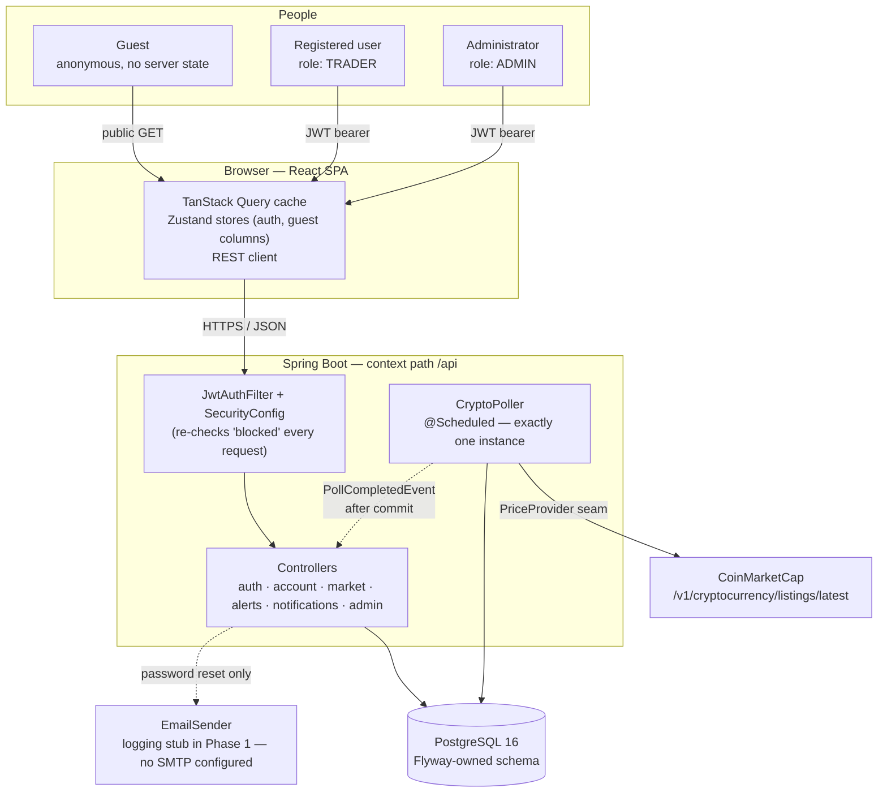

# 01 · System architecture

Guests and registered users share one public read path; only the poller ever talks to
CoinMarketCap, and user-facing requests always read Market Hub's own stored data
(`constraints.md`: "user-facing market reads shall use Market Hub's stored data and shall not wait
for a live CoinMarketCap request").

The poller is the only component with outbound network access to a third party. Every user-facing
read is served from Postgres, never a live provider call — "stored market data" is a product
principle, not an implementation detail.

**Provider independence.** `PriceProvider` is the single seam over CoinMarketCap; only the poller
depends on it. Swapping providers (CoinGecko, Binance) touches one adapter, never the read path or
alert evaluation.
