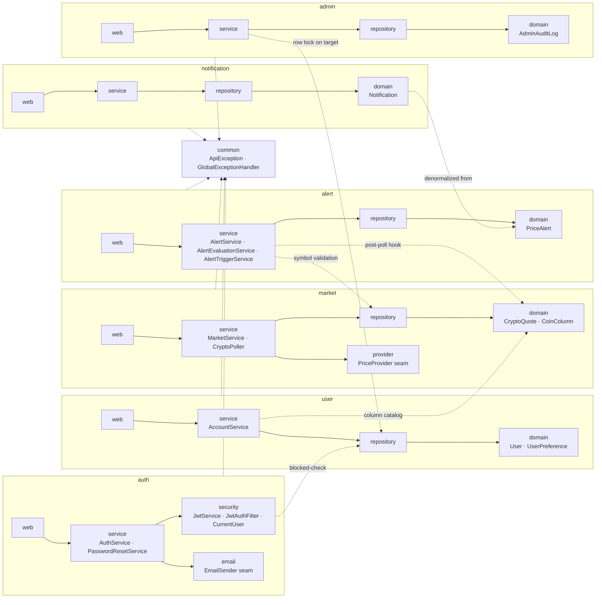
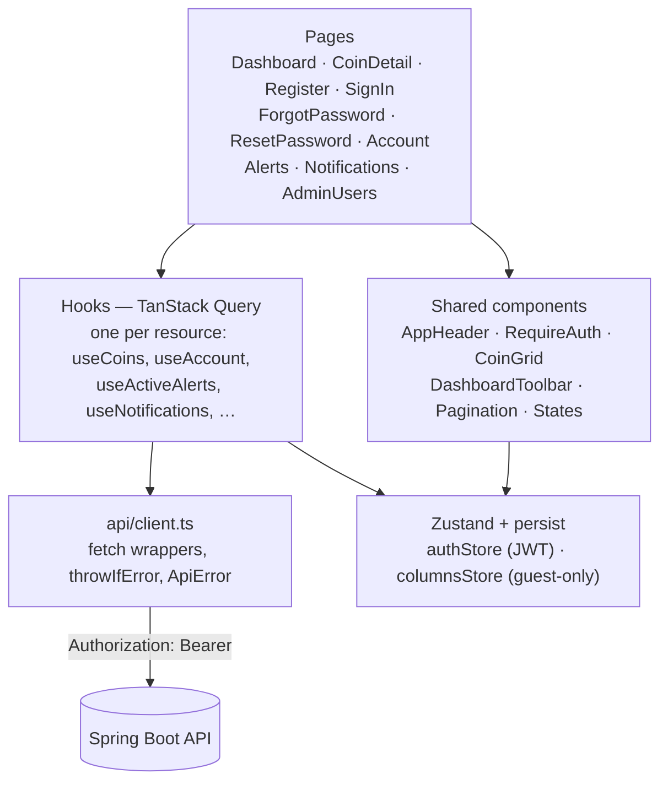

# 02 · Block diagrams

Backend is feature-first, layered inside each feature
(`web → service → {repository, provider} → domain → dto`); dependencies point inward and
cross-feature reuse is explicit, never a reach into another feature's repository.

## 2a · Backend package layout

Solid arrows are the fixed layer order within a feature. Dashed arrows are the only sanctioned
cross-feature reuse — each one is a specific, named dependency, not a general "everything can see
everything."

## 2b · Frontend module layout

One query hook per server resource, no shared "god store" for server state — TanStack Query's
cache *is* the server-state layer. Zustand is reserved for two genuinely client-only things: the
JWT/identity and a guest's unsaved column choice.
