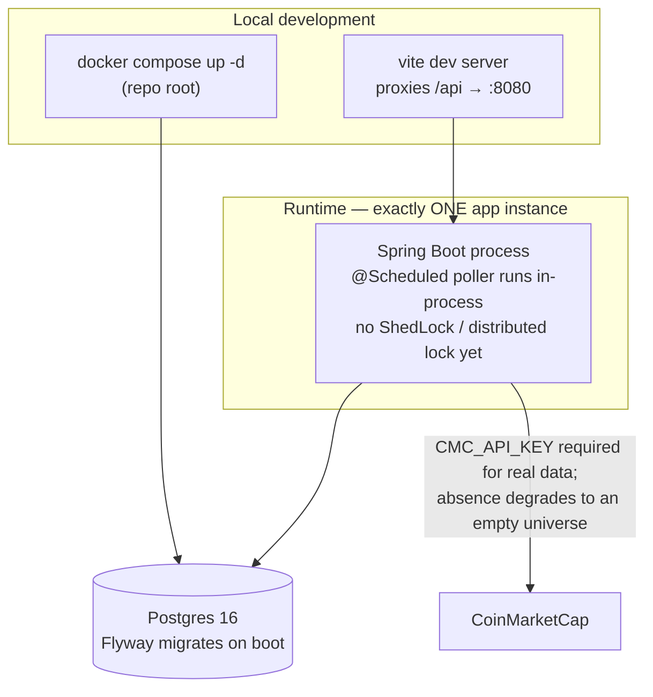

# 03 · Deployment & runtime

No orchestration platform in Phase 1 — one Postgres container, one Spring Boot process. That
second part is a hard constraint, not a starting point.

Running a second app instance would double-poll and double-fire alerts — there is no leader
election. This is an operational rule, enforced by nothing but this document until ShedLock (or
similar) is added.

## Configuration surface

| Variable | Purpose | Default |
|---|---|---|
| `CMC_API_KEY` | CoinMarketCap key; empty ⇒ poller logs a warning, universe stays empty, app still boots | — |
| `POLLER_COIN_LIMIT` | Top-N size | 100 |
| `POLLER_INTERVAL_MS` | Poll cadence | 180000 (3 min) |
| `POLLER_INITIAL_DELAY_MS` | Delay before the first poll | 5000 |
| `JWT_SECRET` | HMAC signing key | dev-only fallback |
| `JWT_EXPIRATION_MS` | Token lifetime | 86400000 (24h) |
| `ADMIN_EMAIL` / `ADMIN_PASSWORD` | One-time startup seed — the only way to become ADMIN | — |
| `AUTH_MAX_FAILED_ATTEMPTS` | Lockout threshold | 5 |
| `AUTH_LOCKOUT_DURATION_MINUTES` | Temporary lock length | 15 |
| `PASSWORD_RESET_TOKEN_LIFETIME_MINUTES` | Reset-token validity | 60 |
| `MARKET_DEFAULT_PAGE_SIZE` / `MARKET_SUPPORTED_PAGE_SIZES` | Dashboard paging | 20 / 20,50,100 |
| `MARKET_DEFAULT_VISIBLE_COLUMNS` | App-wide default column set, validated against `CoinColumn` at boot | see `application.yml` |
