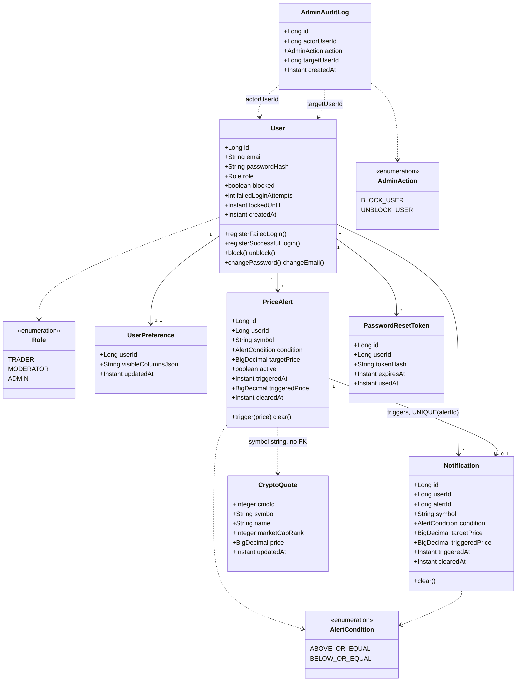

# 04 · Class diagram — domain model

JPA entities only (no Lombok, protected no-arg constructors, static factories). The one deliberate
non-relationship: `PriceAlert.symbol` is a plain string, never a foreign key into `CryptoQuote` —
see the note below.

`AdminAuditLog` is the only entity with no `ON DELETE CASCADE` in either direction — an audit
trail that disappears with its subject isn't an audit trail.

## Why symbol, not a foreign key

The top-N universe churns every poll cycle and provider ids are provider-specific. Coupling
`PriceAlert` to `CryptoQuote` by symbol string keeps alerts durable across universe refreshes (and
a possible provider swap); the accepted cost is a symbol that transiently matches nothing — treated
as "not evaluable this cycle," never an integrity error.
