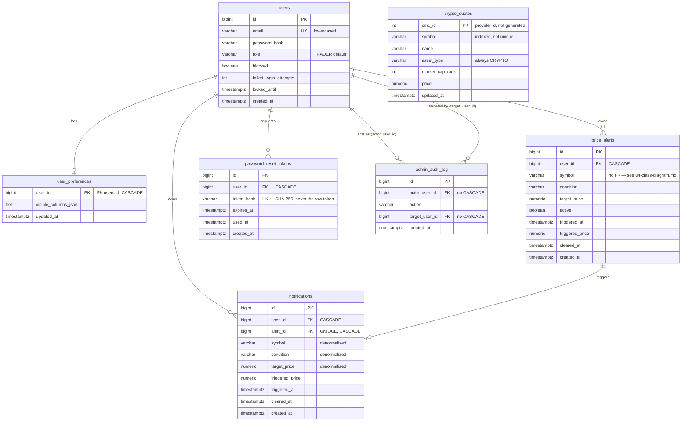

# 05 · Entity-relationship diagram

All seven persisted tables (`V1`–`V8`). `crypto_quotes` sits deliberately outside this graph — it
is a poller-owned read-model, not user data, and nothing has a foreign key into it.

`notifications.alert_id UNIQUE` is the real duplicate-suppression guarantee for
F006-FR-009/F007-FR-001 — verified by deliberately breaking the no-re-arm logic and watching
Postgres reject the second insert with a genuine constraint violation, not a soft application check.
