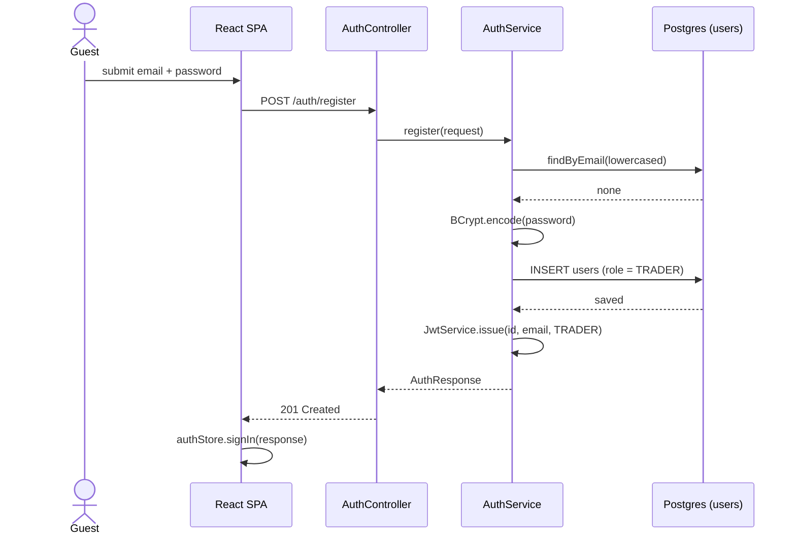
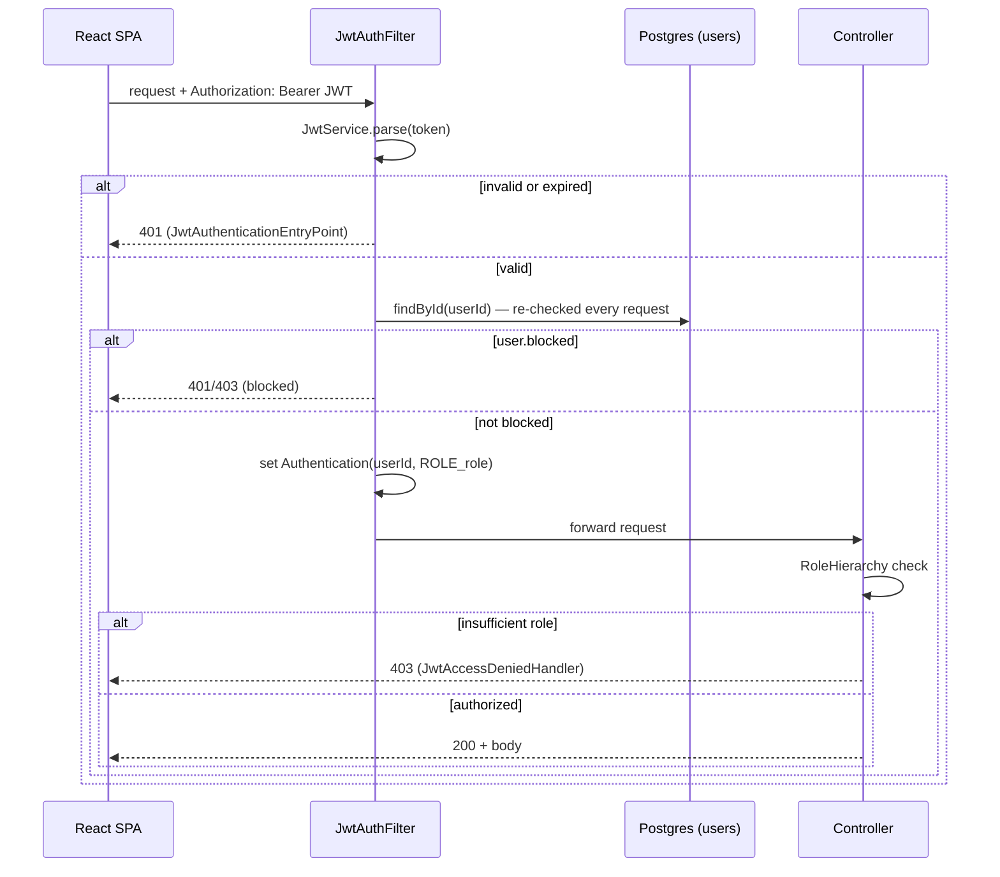
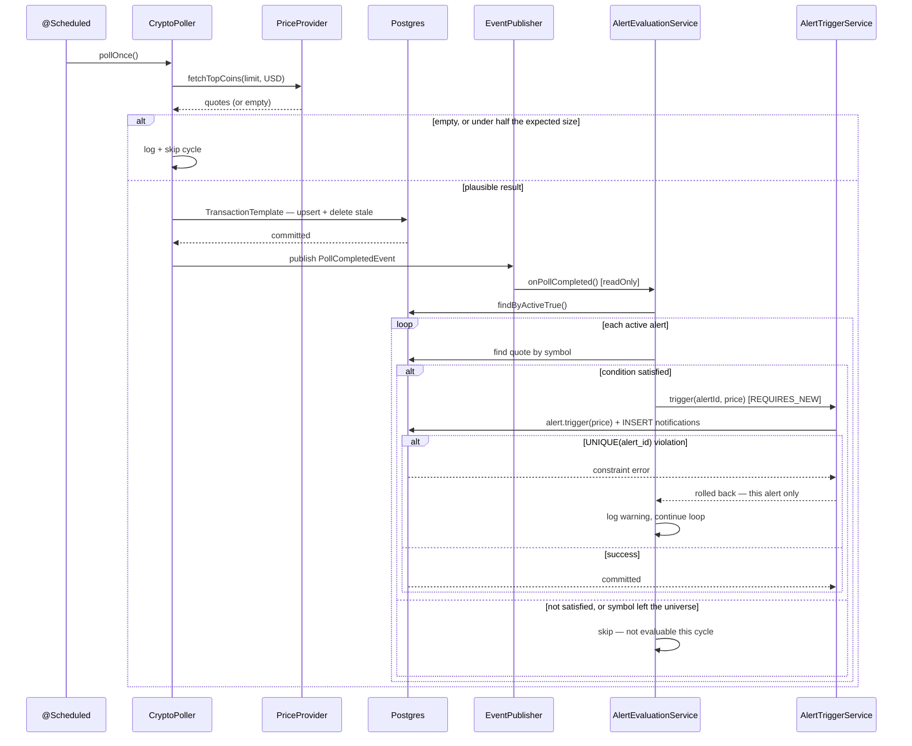

# 08 · Sequence diagrams

Four flows chosen for what's non-obvious about them, not for coverage's sake.

## 8a · Register → JWT issuance



A submitted `role` field is silently dropped — registration structurally cannot self-elevate.

## 8b · Protected request



`blocked` is the one per-request DB check in an otherwise fully stateless authz model — a blocked
account loses access immediately, not at token expiry.

## 8c · Poll cycle → evaluate → trigger → notify



Each alert's trigger + notification commits in its own transaction. One alert's constraint
violation costs only that alert a cycle — it can never roll back another alert that legitimately
fired in the same batch (verified by a break-then-revert test).

## 8d · Password reset

```mermaid
sequenceDiagram
  actor U as User
  participant SPA as React SPA
  participant API as PasswordResetController
  participant Svc as PasswordResetService
  participant DB as Postgres
  participant Mail as EmailSender

  U->>SPA: enter email
  SPA->>API: POST /auth/password-reset/request
  API->>Svc: requestReset(email)
  alt account exists
    Svc->>DB: invalidate prior unused token
    Svc->>Svc: generate token, SHA-256 hash
    Svc->>DB: INSERT password_reset_tokens
  else no account
    Svc->>Svc: equivalent-cost no-op (timing guard)
  end
  Svc-->>API: identical generic response either way
  API->>Mail: send(rawToken) — after the DB transaction commits
  API-->>SPA: 200 generic message
  U->>SPA: open link, set new password
  SPA->>API: POST /auth/password-reset/confirm
  API->>Svc: confirmReset(token, newPassword)
  Svc->>DB: find by hash(token); reject if expired/used
  Svc->>DB: update passwordHash, mark token used, clear lockout
  Svc-->>API: 200
```

The raw token is emailed and hashed on arrival — a stolen database read can never be replayed into
an account takeover.
