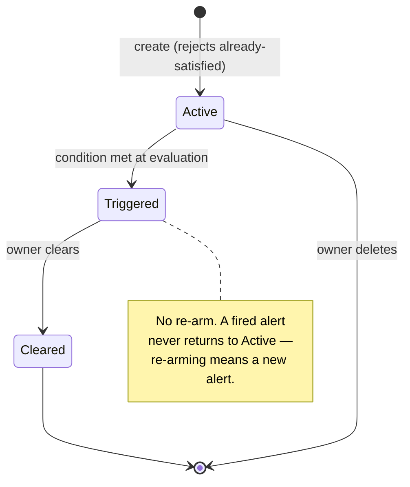
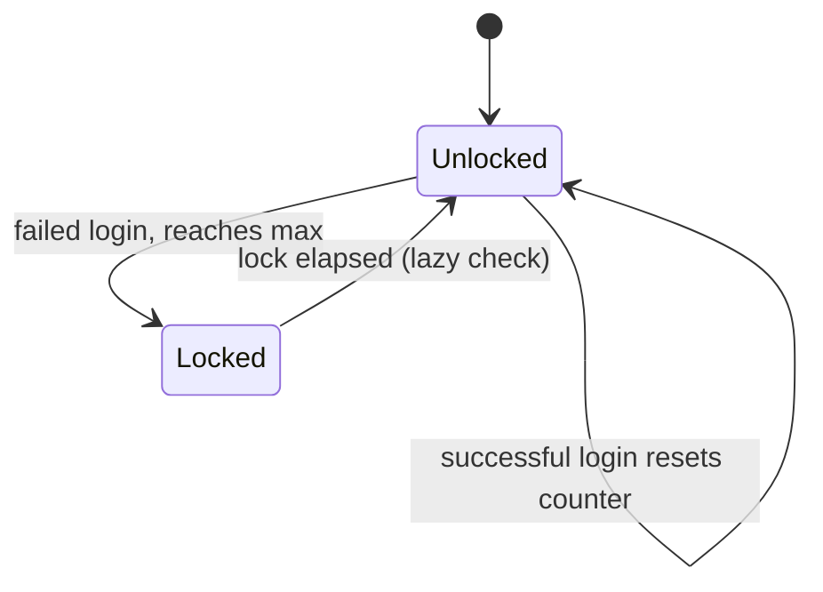
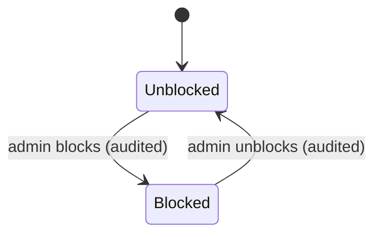

# 09 · State diagrams

## 9a · PriceAlert lifecycle

One-shot, no re-arm.

Creation itself is refused (400) if the condition is already true — an active alert always means a
future crossing.

## 9b · User security state — two independent axes

Deliberately not one state machine. An admin unblock must never clear a brute-force lock, and an
expiring lock must never restore a blocked account.

### Lockout — self-expiring, checked at sign-in only

### Block — admin-controlled, checked at sign-in *and* on every authenticated request

