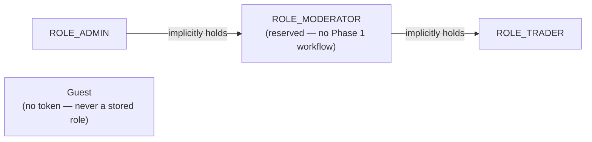

# 10 · Security & authorization model

One `role` enum column, not a join table. Role travels as a JWT claim — authorization is stateless
except for the per-request `blocked` check (see [08 · Sequence diagrams, 8b](08-sequence-diagrams.md#8b--protected-request)).

## JWT claim shape

| Claim | Value |
|---|---|
| `sub` | email (lowercased) |
| `userId` | numeric account id |
| `role` | `TRADER` / `MODERATOR` / `ADMIN` |
| `iat` / `exp` | issued-at / expiry — HMAC-signed, default 24h lifetime |

## Access matrix

| Surface | Guest | TRADER | ADMIN |
|---|---|---|---|
| Public market read (`GET /market/**`) | ✓ | ✓ | ✓ |
| Own account / alerts / notifications / preferences | — | ✓ | ✓ |
| `/admin/**` (view + block/unblock) | — | — | ✓ |
| Change another user's role at runtime | — | — | — *(not a Phase 1 capability at all)* |

**Admin bootstrap.** The only way to become ADMIN in Phase 1 is the env-provisioned startup seed
(`ADMIN_EMAIL`/`ADMIN_PASSWORD`). Registration always mints TRADER; there is no runtime role-change
endpoint.
